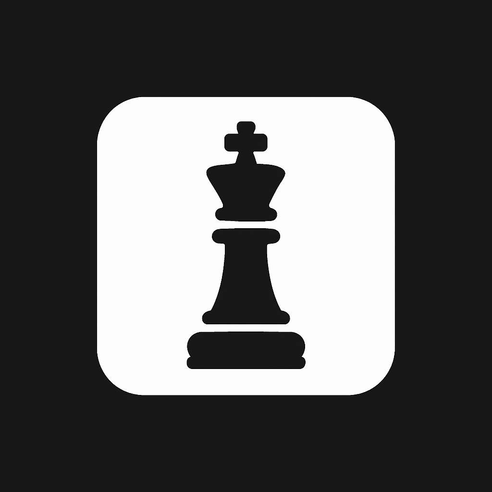
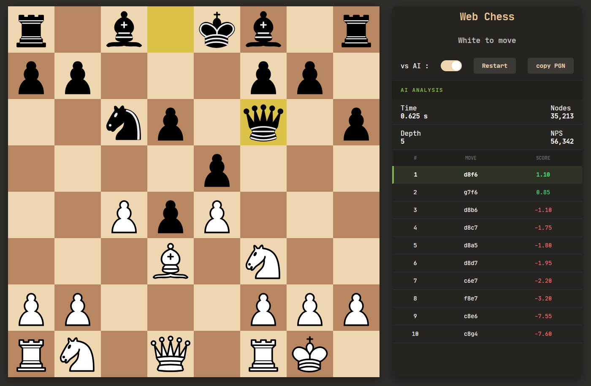

# Web Chess AI

<p align="center">

</p>

<p align="center">


</p>

A high-performance, web-based chess engine featuring a custom **Negamax-based AI**. The project combines a modern "Chess.com style" analysis interface with a Python backend optimized for speed and deep positional evaluation.

---

## Features

* **Hybrid Search Engine**: Uses Negamax with Alpha-Beta pruning, optimized with **Multi-PV** and **Hybrid Depth** for accurate top-move analysis.
* **Performance Optimized**: Designed to run with **PyPy**, achieving significantly higher nodes-per-second than standard CPython.
* **Professional UI**: A minimalist sidebar analysis panel providing real-time engine statistics (NPS, Depth, Evaluation).
* **Move Ordering**: Implements MVV-LVA, Killer Move heuristics, and History heuristics to maximize pruning efficiency.
* **Opening Book**: Integrated with Polyglot opening books for a grandmaster-level start.

## Technical Stack

* **Frontend**: Vanilla JavaScript (ES6+), CSS3 (Flexbox/Grid), and HTML5.
* **Backend**: Python with Flask for real-time communication.
* **AI Engine**:
* **Logic**: Negamax with Alpha-Beta Pruning.
* **Evaluation**: Piece-Square Tables (PST) + Mobility heuristics.
* **Optimization**: Iterative Deepening & Transposition Tables.

## How the AI Thinks (The Negamax Algorithm)

Our AI's core decision-making process is powered by the **Negamax algorithm**, a variant of Minimax. At its heart, Negamax seeks to maximize the score for the current player, knowing that the opponent will always try to maximize their score (which is equivalent to minimizing the current player's score).

Here's how it works:

1. **Search Tree**: The AI explores a "game tree" where each node represents a chess position and each branch represents a possible move.
2. **Evaluation Function**: For every position at the end of its search depth, the AI uses an `evaluate()` function. This function assigns a numerical score to the position (e.g., +100 for a pawn advantage, -200 for a lost knight). Positive scores favor White, negative scores favor Black.
3. **Alpha-Beta Pruning**: To avoid exploring every single branch (which would be too slow), Alpha-Beta pruning is employed. It smartly "cuts off" branches that it determines will not lead to a better outcome than what has already been found.
4. **Iterative Deepening**: The AI starts with a shallow search and progressively increases its depth. This allows it to quickly find a good move and then refine it if more time is available.
5. **Transposition Tables**: To avoid re-evaluating the same position multiple times (due to different move orders leading to the same board state), a hash table stores previously calculated scores.
6. **Move Ordering**: Before searching, moves are ordered by a heuristic (e.g., capturing the most valuable piece with the least valuable piece, or "Killer Moves" which were good in sibling branches). This helps Alpha-Beta prune more effectively.
7. **Hybrid Depth for UI**: To provide meaningful scores for the top moves in the analysis panel, the engine uses a **Hybrid Depth Search**. It performs a full, accurate search for the few most promising moves, while using a reduced depth for less promising moves to maintain overall speed. This ensures the UI presents distinct and accurate evaluations without a significant performance penalty.

## UI Showcase: Real-time Analysis

Experience chess with an integrated analysis panel, mirroring the clean, functional design of professional platforms like Chess.com. The sidebar provides live updates on the AI's thought process and offers insights into the best moves.

<p align="center">


<em>The sleek analysis sidebar updates in real-time, showing key engine metrics and the top move candidates.</em>
</p>

## Installation & Usage

1. **Clone the repository**

```bash
git clone https://github.com/aitaneuh/chess-web.git
cd chess-web
```

2. **Setup the Backend** (PyPy recommended for performance)

```bash
cd server
pypy3 -m pip install flask python-chess
pypy3 server.py
```

3. **Launch the Web Interface**
Open `index.html` in your browser or serve via Flask.

## AI Evaluation Logic

The engine utilizes a **Hybrid Depth Search** at the root to ensure the analysis panel displays unique scores for the top 10 moves. This balances the speed of Alpha-Beta pruning with the precision of a Multi-PV output.
